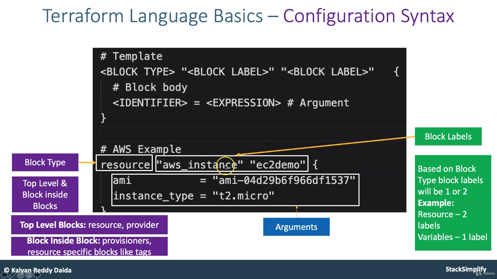
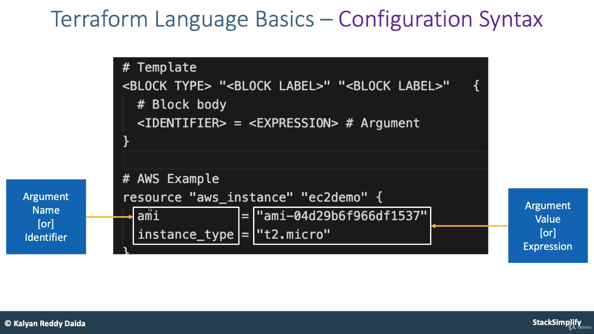
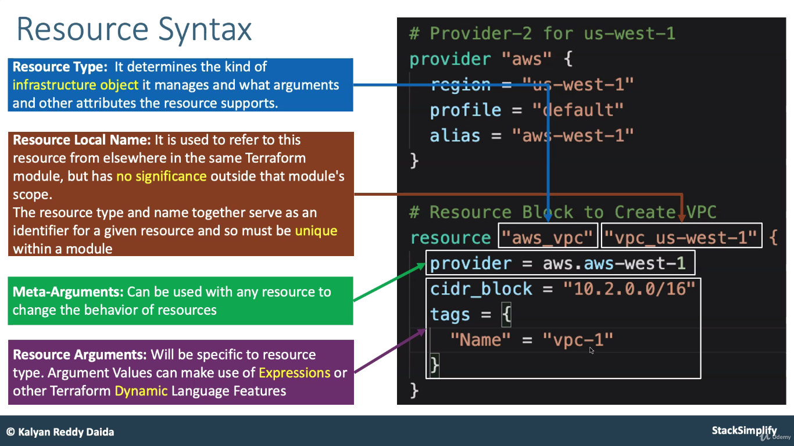

# Terraform resource syntax 
# Block type Block Lable
```
- Block Type
- Block Lables
```


#   Aurgement-Name & Aurgement Value
```
- Aurgement Name or Identifire
- Aurgement Value or Expression
```



# Resource Syntax
```
- Resource Type
- Resource Local Name
- Meta Aurgements
- Resourc Aurgements
```



