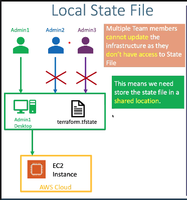
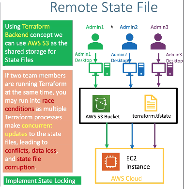

## Terraform Backend remote state storage
- what is a terraform Backend ?
  - Backends are responsible for storing the state
  - And providing an API for State locking.

## In Terraform Backend prospective we have two things 
  - Terraform State storage when you are using Aws provider,we can store `terraform.tfstate` in **AWS S3 BUCKET**
  - Whils Implementing the `Terraform State Locking` we will using the DynamoDB from AWS

## What is the probleam with the local state file and how we resolve it with Remote state file
**with the local state file**
- Multiple Team Members cannot update the infrastructure as they don't have asscess to state file.
- This means we need to store State file in a shared location.

## Local State File
  

**Using the Remote State Sorage**
- Using terraform Backend Concept we can use `AWS S3` as the shared storage for state file
- If two team members are running the terraform at the same time, you may run into race conditions as multiple Terraform Processes make concorrent updates to the state files, leadin to `conflicts`, `data lost`, and state file `curruption`.
- implementing state locking 
## Remote state file
  

## Terraform Remote State File with State Locking 
- Note all Backend support State locking. AWS S3 supports State Locking 
- State locking happens automatically on all operations that could `write state.` ex: terraform apply terraform destroy 
- If State locking Fails, Terraform will not continue.
- you can disable state locking for most 