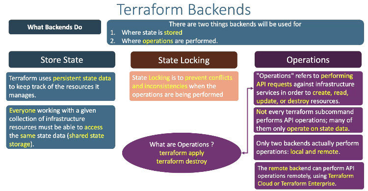

## Terraform Execution also do using by.
- Terraform CLI
- Terraform cloud
- Terraform Enterprise

## Terraform Backend 
- Each Terraform Configuration can specify a backend, which defines wher and how operations are performed, wher state snapshots are stored, etc

**Wher this backends are used**
- terraform backend configuration is only used by terraform CLI
- `Terraform cloud` and `terraform Enterprise` always use their own state storage when prompting the run,so they ignore  any backend block in the configuration.
- From Terraform colud users alsp always recomended to use backend block in terraform configuration 
- Some command like `terraform taint` which can executed only using terraform CLI

## What Backend do.
- Ther are two things backends will be used for
    - where state is stored 
    - where operations are performed 
## Terraform backend can see in three dimentional way
- Store State
- State Locking 
- opreations

# Store State
- Terraform uses Persistent state data to keep track of the resources it manages.
- Everyone working with a given collection of infrastructure resources must be able to access the asme state data.(shared state storage).

## State Locking 
- state locking is to prevent the conflicts and inconsistensies when operation are being preformed 

## opreations
- operations refers to performing API requests against infrastructure services in order to create read update and destroy resources.
    - What are Operations ?
        - terraform apply 
        - terraform destroy 

- Not every terraform subccommands performs API operations; may of them only operate on a state Data.
- only two backens actually perform operations local and remote 
    - `local` means where your terraform.tfstate file is avillable in your system 
    - `Remote` here is a 2-types
        - s3-backend, wher you cannot perform operations 
        - terraform cloud inside the terraform cloud perform the operations ina detail maner 
        - The remote backend can perform API operations remotely using Terraform cloud or terraform enterprise.
## Terraform Backend

## Backend Types 