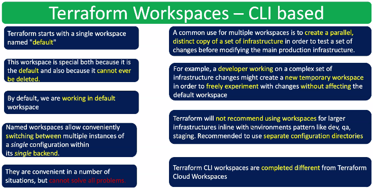
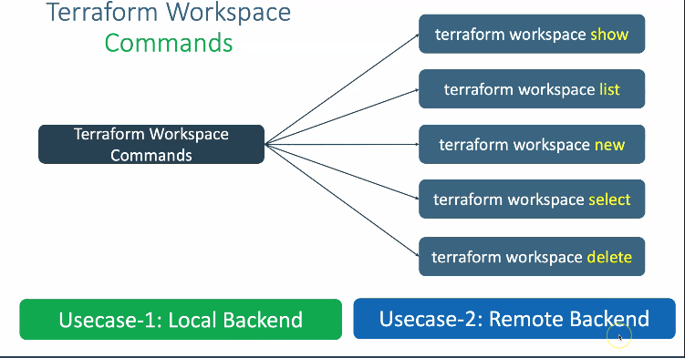

# Terraform Workspace 
- terraform starts with a single workspace named **default**
- This work space is Special both because it is the default,And because it cannot ever be deleted.
- By default we are working in default workspace 
- **The advantage of using this Named workspace allow us conveninently switching between multiple instances of a single configuration within its single backend**
- the comman use for multiple workspace is to create a parallel distinct copy of set of infrastructure in order to test a set of chainges before modifying the main production infrastructure 
- For example, a developer working on a complex set of infrastructure chainges might create a new temporary workspace in order to freely experment with changes without effectin the default workspace 

- terraform will not recommend using workspace for large infrastructure inline with envinorment patter like dev,qa,staging.Recomended to use seperate configuration directories
- terraform CLI completly different from terraform Cloud workspaces

### terraform workspace - cli based

### terraform workspace commands 
- terraform workspace show 
- terraform workspace list 
- terraform workspace new
- terraform workspace select
- terraform workspace delete

## usecase
- local backend
- remote backend

## what is a terraform Workspace ?
**Ans :** - A developer is working a on complex set of infrastructure chainges 
          - Might create New Tempory work space in order to freely exprement with chainges with out affecting the default workspace 
          - terraform will not recomemnd using the workspace for large infractures inline with enveronmental patterns like **DEV**,**QA**,**STAGING**

 
