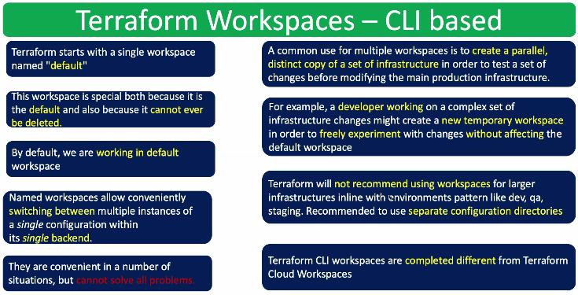
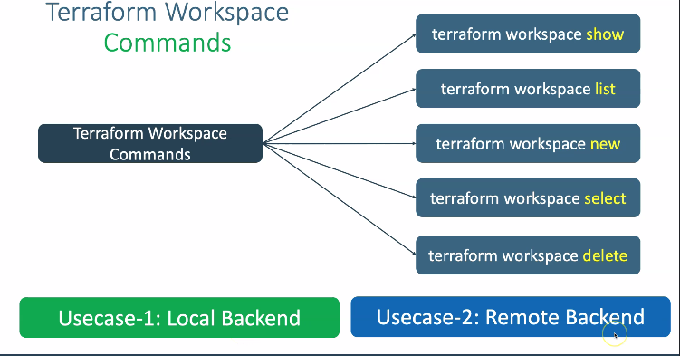

# Terraform Workspace 
- terraform starts with a single workspace named **default**
- This work space is Special both because it is the default,And because it cannot ever be deleted.
- By default we are working in default workspace 
- **The advantage of using this Named workspace allow us conveninently switching between multiple instances of a single configuration within its single backend**
- the comman use for multiple workspace is to create a parallel distinct copy of set of infrastructure in order to test a set of chainges before modifying the main production infrastructure 
- For example, a developer working on a complex set of infrastructure chainges might create a new temporary workspace in order to freely experment with changes without effectin the default workspace 

- terraform will not recommend using workspace for large infrastructure inline with envinorment patter like dev,qa,staging.Recomended to use seperate configuration directories
- terraform CLI completly different from terraform Cloud workspaces


### terraform workspace - cli based

### terraform workspace commands 
- terraform workspace show 
- terraform workspace list 
- terraform workspace new
- terraform workspace select
- terraform workspace delete

## usecase
- local backend
- remote backend


## what is a terraform Workspace ?
**Ans :** - A developer is working a on complex set of infrastructure chainges 
          - Might create New Tempory work space in order to freely exprement with chainges with out affecting the default workspace 
          - terraform will not recomemnd using the workspace for large infractures inline with enveronmental patterns like **DEV**,**QA**,**STAGING** Recomended to use Seperate configuration directories 
##### -----------------------------------------------------------------------------------------------

# Terraform Workspaces

## Step-01: Introduction
- We are going to create 2 more workspaces (dev,qa) in addition to default workspace
- Update our terraform manifests to support `terraform workspace` 
  - Primarily for security group name to be unique for each workspace
  - In the same way for EC2 VM Instance Name tag. 
- Master the below listed `terraform workspace` commands
  - terraform workspace show
  - terraform workspace list
  - terraform workspace new
  - terraform workspace select
  - terraform workspace delete


## Step-02: Update terraform manifests to support multiple workspaces
- **Sub-folder we are working on:** v1-local-backend
- Ideally, AWS don't allow to create a security group with same name twice. 
- With that said, we need to change our security group names in our `c2-security-groups.tf`
- At the same time, just for reading convenience we can also have our EC2 Instance `Name tag` also updated inline with workspace name. 
- What is **${terraform.workspace}**? - It will get the workspace name 
- **Popular Usage-1:** Using the workspace name as part of naming or tagging behavior
- **Popular Usage-2:** Referencing the current workspace is useful for changing behavior based on the workspace. For example, for non-default workspaces, it may be useful to spin up smaller cluster sizes.
```t
# Change-1: Security Group Names
  name        = "vpc-ssh-${terraform.workspace}"
  name        = "vpc-web-${terraform.workspace}"  

# Change-2: For non-default workspaces, it may be useful to spin up smaller cluster sizes.
  count = terraform.workspace == "default" ? 2 : 1  
This will create 2 instances if we are in default workspace and in any other workspaces it will create 1 instance

# Change-3: EC2 Instance Name tag
    "Name" = "vm-${terraform.workspace}-${count.index}"

# Change-4: Outputs
  value = aws_instance.my-ec2-vm.*.public_ip
  value = aws_instance.my-ec2-vm.*.public_dns    
You can create a list of all of the values of a given attribute for the items in the collection with a star. For instance, aws_instance.my-ec2-vm.*.id will be a list of all of the Public IP of the instances.  
```

## Step-03: Create resources in default workspaces
- Default Workspace: Every initialized working directory has at least one workspace. 
- If you haven't created other workspaces, it is a workspace named **default**
- For a given working directory, only one workspace can be selected at a time.
- Most Terraform commands (including provisioning and state manipulation commands) only interact with the currently selected workspace.
```t
# Terraform Init
terraform init 

# List Workspaces
terraform workspace list

# Output Current Workspace using show
terraform workspace show

# Terraform Plan
terraform plan
Observation: This should show us two instances based on the statement in EC2 Instance Resource "count = terraform.workspace == "default" ? 2 : 1" because we are creating this in default workspace

# Terraform Apply
terraform apply -auto-approve

# Verify
Verify the same in AWS Management console
Observation: 
1) Two instances should be created with name as "vm-default-0, vm-default-1")
2) Security Groups should be created with names as "vpc-ssh-default, vpc-web-default)
3) Observe the outputs on CLI, you should see list of Public IP and Public DNS 
```

## Step-04: Create New Workspace and Provision Infra 
```t
# Create New Workspace
terraform workspace new dev

# Verify the folder
cd terraform.tfstate.d 
cd dev
ls
cd ../../

# Terraform Plan
terraform plan
Observation:  This should show us creating only 1 instance based on statement "count = terraform.workspace == "default" ? 2 : 1" as we are creating this in non-default workspace named dev

# Terraform Apply
terraform apply -auto-approve

# Verify Dev Workspace statefile
cd terraform.tfstate.d/dev
ls
cd ../../
Observation: You should fine "terraform.tfstate" in "current-working-directory/terraform.tfstate.d/dev" folder

# Verify EC2 Instance in AWS mgmt console
Observation:
1) Name should be with "vm-dev-0"
2) Security Group names should be as "vpc-ssh-dev, vpc-web-dev"
```

## Step-05: Switch workspace and destroy resources
- Switch workspace from dev to default and destroy resources in default workspace
```t
# Show current workspace
terraform workspace show

# List Worksapces
terraform workspace list

# Workspace select
terraform workspace select default

# Delete Resources from default workspace
terraform destroy 

# Verify
1) Verify in AWS Mgmt Console (both instances and security groups should be deleted)
```

## Step-06: Delete dev workspace
- We cannot delete "default" workspace
- We can delete workspaces which we created (dev, qa etc)
```t
# Delete Dev Workspace
terraform workspace delete dev
Observation: Workspace "dev" is not empty.
Deleting "dev" can result in dangling resources: resources that
exist but are no longer manageable by Terraform. Please destroy
these resources first.  If you want to delete this workspace
anyway and risk dangling resources, use the '-force' flag.

# Switch to Dev Workspace
terraform workspace select dev

# Destroy Resources
terraform destroy -auto-approve

# Delete Dev Workspace
terraform workspace delete dev
Observation:
Workspace "dev" is your active workspace.
You cannot delete the currently active workspace. Please switch
to another workspace and try again.

# Switch Workspace to default
terraform workspace select default

# Delete Dev Workspace
terraform workspace delete dev
Observation: Successfully delete workspace dev

# Verify 
In AWS mgmt console, all EC2 instances should be deleted
```

## Step-07: Clean-Up Local folder
```t
# Clean-Up local folder
rm -rf .terraform*
rm -rf terraform.tfstate*
```

## Step-08: Terraform Workspaces in combination with Terraform Backend (Remote State Storage)
### Step-08-01: Review terraform manifest (primarily c1-versions.tf)
- **Reference Sub-Folder:** v2-remote-backend
- Only change in the template is in **c1-versions.tf**, we will have the remote backend block which we learned during section **07-01-Terraform-Remote-State-Storage-and-Locking**
```t
  # Adding Backend as S3 for Remote State Storage
  backend "s3" {
    bucket = "terraform-stacksimplify"
    key    = "workspaces/terraform.tfstate"
    region = "us-east-1"  
  # For State Locking
    dynamodb_table = "terraform-dev-state-table"           
  }
```
### Step-08-02: Provision infra using default workspace
```t
# Initialize Terraform
terraform init

# List Terraform Workspaces
terraform workspace list

# Show current Terraform workspace
terraform workspace show

# Terraform Validate
terraform validate

# Terraform Format
terraform fmt

# Terraform Plan
terraform plan

# Terraform Apply
terraform apply -auto-approve

# Review State file in S3 Bucket for default workspace
Go to AWS Mgmt Console -> Services -> S3 -> terraform-stacksimplify -> workspaces -> terraform.tfstate
```
### Step-08-03: Create new workspace dev and provison infra using that workspace
```t
# List Terraform Workspaces
terraform workspace list

# Create New Terraform Workspace
terraform workspace new dev

# List Terraform Workspaces
terraform workspace list

# Show current Terraform workspace
terraform workspace show

# Terraform Plan
terraform plan

# Terraform Apply
terraform apply -auto-approve

# Review State file in S3 Bucket for dev workspace
Go to AWS Mgmt Console -> Services -> S3 -> terraform-stacksimplify -> env:/ -> dev -> workspaces -> terraform.tfstate
```

### Step-08-04: Destroy resources in both workspaces (default, dev)

```t
# Show current Terraform workspace
terraform workspace show

# Destroy Resources in Dev Workspace
terraform destroy -auto-approve

# Show current Terraform workspace
terraform workspace show

# Select other workspace
terraform workspace select default

# Show current Terraform workspace
terraform workspace show

# Destroy Resources in default Workspace
terraform destroy -auto-approve

# Delete Dev Workspace
terraform workspace delete dev
```
### Step-08-05: Try deleting default workspace and understand what happens

```t
# Try deleting default workspace
terraform workspace delete default
Observation: 
1) Workspace "default" is your active workspace.
2) You cannot delete the currently active workspace. Please switch
to another workspace and try again.

# Create new workspace
terraform workspace new test1

# Show current Terraform workspace
terraform workspace show

# Try deleting default workspace now
terraform workspace delete default
Observation:
1) can't delete default state
```

### Step-08-06: Clean-Up
```t
# Switch workspace to default
terraform workspace select default

# Delete test1 workspace
terraform workspace delete test1

# Clean-Up Terraform local folders
rm -rf .terraform*

# Clean-Up State files in S3 bucket 
Go to S3 Bucket and delete files
```


## References
- [Terraform Workspaces](https://www.terraform.io/docs/language/state/workspaces.html)
- [Managing Workspaces](https://www.terraform.io/docs/cli/workspaces/index.html)


 
