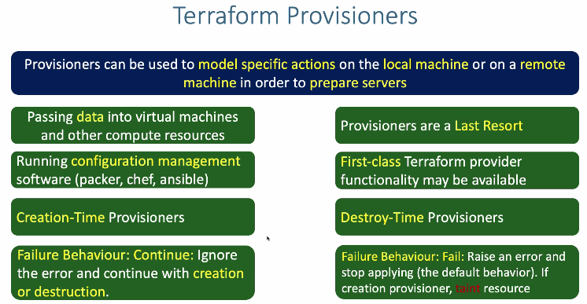
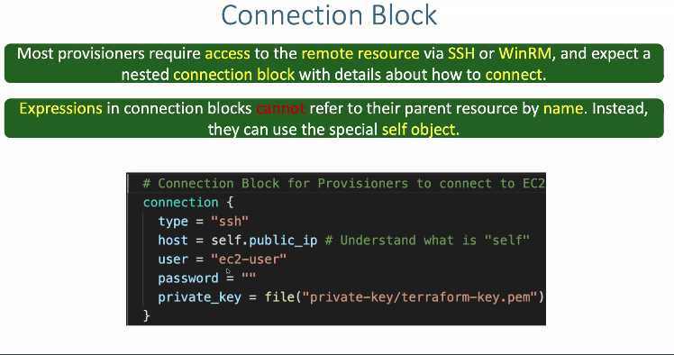
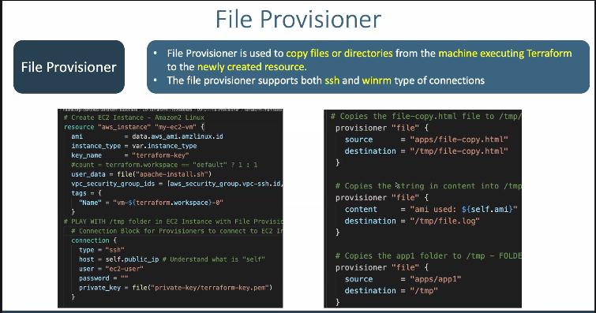
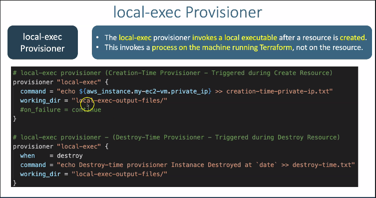
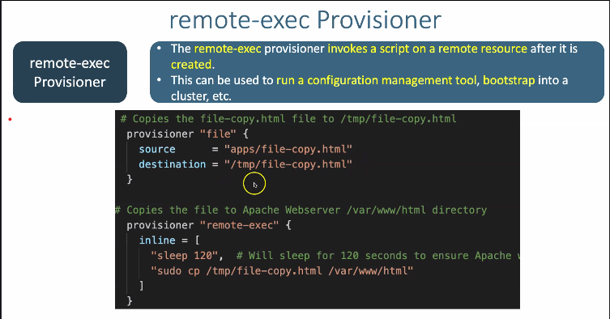

## Terraform provisioners 

## Types of provisioners
**provisioner types**
- file provisioner 
- remote-exec provisioner
- local-exec Provisioner
- null-resource & provisioners

**Connection Block**
- Most provisioners requires access to the remote resource vis `ssh,WinRM` it expect a nested connection block with details about how to conect
- expressions in connection blocks cannot refer to there parrent resource by name,instade they can use the special self object.

### File Provisioners
- file provisioner is used to copy files or directories form mechine executing terraform to the newly created resource
- file provisioner supports both ssh and winrm type connections 

### Local Exec Provisioner  
- The local-exec provisioner invokes a local executible after a resource is created 
- This invokes a process on the machine running Terraform, not on the resource.

### Remote Exec Provisioner
- The remote-exec provisioner invokes a script on a remote resource after it is created 
- This can be used to run a configuration management tool,boot strap into a cluster,etc

### Null-Resource & Provisioners
- If you need to run provisioners `that aren't directly associated with a specificre source`. you can associate them with a `null_resource`
- Instances of a null_resource are treated like normal resources, but they dont do anything 