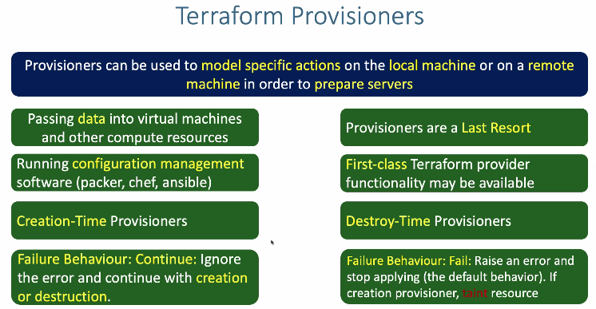

## Terraform provisioners 

## Types of provisioners
**provisioner types**
- file provisioner 
- remote-exec provisioner
- local-exec Provisioner
**Connection Block**
- Most provisioners requires access to the remote resource vis `ssh,WinRM` it expect a nested connection block with details about how to conect
- expressions in connection blocks cannot refer to there parrent resource by name 